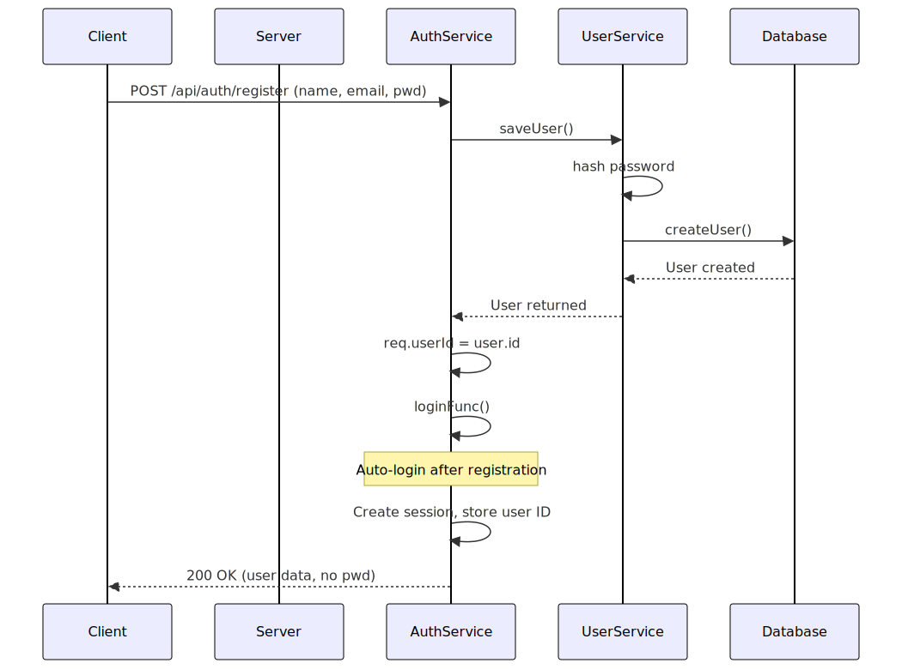
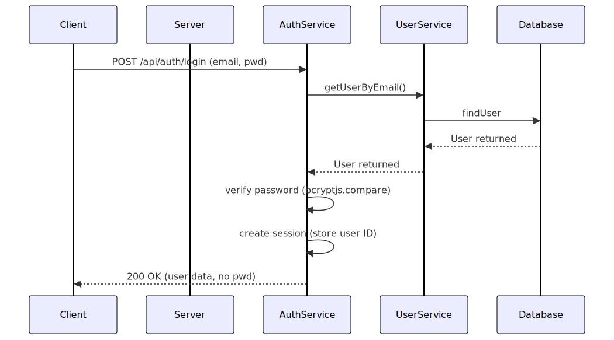
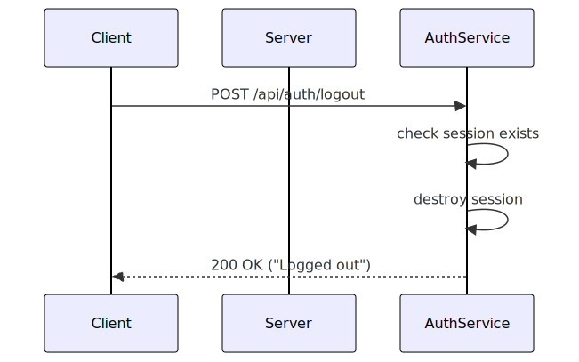

# Authentication System Diagrams

This directory contains visual diagrams that illustrate the authentication flows and system architecture.

## Available Diagrams

| Diagram | Description | Source File | Output File |
|---------|-------------|------------|------------|
| Registration Flow | User registration process | [registration-flow.mmd](./registration-flow.mmd) | [registration-flow.svg](./registration-flow.svg) |
| Login Flow | User login process | [login-flow.mmd](./login-flow.mmd) | [login-flow.svg](./login-flow.svg) |
| Logout Flow | User logout process | [logout-flow.mmd](./logout-flow.mmd) | [logout-flow.svg](./logout-flow.svg) |

Registration


Login


Logout


## About the Diagrams

These diagrams are created using Mermaid, a markdown-based diagramming tool. Each diagram consists of:
- A source file (`.mmd`) with the Mermaid syntax
- A generated SVG file (`.svg`) for viewing in documentation

## How to View Diagrams

You can view the SVG files in several ways:
- Directly in your browser by opening the SVG file
- In GitHub when viewing the corresponding documentation files
- In most markdown editors that support image embedding

## Editing Diagrams

To edit an existing diagram:

1. Edit the `.mmd` source file with your changes
2. Use the Mermaid CLI to regenerate the SVG:

```bash
mmdc -i input.mmd -o output.svg
```

For example:

```bash
mmdc -i ./login-flow.mmd -o ./login-flow.svg
```

## Creating New Diagrams

To create a new diagram:

1. Create a new `.mmd` file with your Mermaid code
2. Generate the SVG using Mermaid CLI
3. Update this README to reference the new diagram

## Mermaid Syntax Reference

The diagrams use Mermaid's sequence diagram syntax. Here's a quick reference:

```
sequenceDiagram
    participant A as Actor A
    participant B as Actor B
    
    A->>B: Request
    B-->>A: Response
    
    Note over A,B: A note spanning two actors
    Note over A: A note on one actor
```

For more details on Mermaid syntax, visit the [Mermaid Documentation](https://mermaid-js.github.io/mermaid/#/sequenceDiagram).

## Installing Mermaid CLI

If you don't have Mermaid CLI installed, you can install it using npm:

```bash
npm install -g @mermaid-js/mermaid-cli
```

Then you can use the `mmdc` command to generate diagrams. 